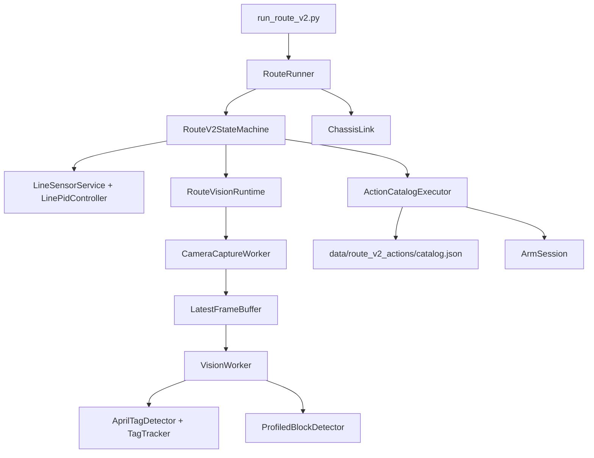

# RoboGame 自动化程序

这是机器人比赛的现场自动化程序。仓库只保留可部署的运行时代码、动作包、配置和树莓派维护脚本；录像、抓帧、实验导出、历史交接资料和测试目录已移出。

## 运行入口

在树莓派运行完整路线：

```powershell
cd C:\Users\LJY\Desktop\RG\runtime
python run_route_v2.py --full --config config/route_v2.yaml
```

先做不接硬件的路线检查：

```powershell
cd C:\Users\LJY\Desktop\RG\runtime
python run_route_v2.py --dry-run --full --config config/route_v2.yaml
```

`--only STATE`、`--from STATE`、`--to STATE` 和 `--until STATE` 可以把现场检查限制在某一段。硬件运行默认把逐 tick 遥测写入 `runtime/logs/`；日志目录属于运行时产物，不进入仓库。

## 目录结构

```text
runtime/
├─ run_route_v2.py          # 自动路线入口、硬件生命周期和主控制循环
├─ route_v2/                # 路线状态机、库存策略、视觉任务、动作执行器
├─ rg_runtime/              # 底盘、机械臂、巡线、相机和 AprilTag 设备适配层
├─ control_hub/             # 浏览器控制台和动作包录制/导出服务
├─ config/                  # 路线、相机标定和设备配置
├─ data/route_v2_actions/   # 唯一运行时动作包目录和 catalog.json
├─ deploy/                  # udev 设备规则
└─ requirements.txt         # Python 运行依赖
pi-tools/                   # Windows 侧 SSH 部署、启动、停止、状态和动作检查脚本
```

`runtime/` 是部署到 `/home/pi/robogame-runtime` 的程序；`pi-tools/` 在开发机上运行，通过 SSH 把它部署到树莓派。密码只从 `RG_PI_PW` 环境变量读取，代码和仓库不保存口令。

## 架构设计



主循环每个 tick 读取巡线传感器、编码器、相机结果和机械臂动作状态，再由状态机生成一个明确的 `RouteIntent`：巡线速度、横移、里程动作、等待或安全停止。`RouteRunner` 只负责把意图发送给设备、等待动作确认、维护遥测和在异常时执行停止与资源释放。设备层不包含路线策略，因此可以用 dry-run 的虚拟底盘替换真实硬件。

路线状态覆盖起点到 J1/J2/J3、紫色取物、橙色取物、搭建、找线和安全停止。库存使用三个物理槽位 `left_slot`、`right_slot`、`suction_slot` 记录，动作完成后才更新库存；车辆最多携带三个方块。搭建位置当前按里程计算：`build_first_right_cm + build_right_step_cm * skip`，不依赖搭建区视觉的“是否看见方块”判断。

底盘链路由 `ChassisLink` 独占串口并负责连接恢复；机械臂由 `ArmSession` 发送 `SERVO`、`SUCTION` 和动作确认；巡线服务把传感器帧转换成黑线 mask。`LinePidController` 根据线误差输出前进、横向和偏航修正，并由状态机决定何时进入转弯、找线或里程闸门。

## 视觉实现

视觉线程与路线控制解耦。`CameraCaptureWorker` 持续读取最新相机帧并写入线程安全的 `LatestFrameBuffer`；`VisionWorker` 按状态选择一个 `VisionTask`，只处理最新帧，并用 generation 与 frame id 丢弃过期结果。这样视觉处理变慢时不会阻塞底盘控制，也不会把上一状态的识别结果带入下一状态。

视觉任务分为 AprilTag 和方块两类：

- `AprilTagDetector` 使用 OpenCV `DICT_APRILTAG_36h11`，先按相机标定去畸变，再输出 tag id、角点、中心和可选的位姿。
- `TagTracker` 对目标 id 做位置/尺寸 gate，并要求连续多帧确认；短暂漏检只计入 missed frames，超过上限才清除稳定状态。
- `ProfiledBlockDetector` 按配置文件中的 ROI、HSV/LAB/YCrCb 色带、形态学开闭运算和轮廓指标筛选橙色或紫色方块。面积、宽高比、矩形度、位置、底边和近场填充率逐项 gate；被拒绝的轮廓保留原因，便于现场遥测定位误检。
- 取物区的 `PickupVisionController` 用有限状态机完成搜索、端点确认、回到基线、目标确认、横向对中和窗口复核。只有连续稳定且新鲜的识别结果才能触发动作包。

视觉阈值全部放在 `runtime/config/route_v2.yaml` 的 profile 中，代码只实现通用算法。相机尺寸、内参、畸变和 AprilTag 尺寸放在 `config/camera_config.yaml`；更换镜头或安装角度时只更新配置并重新标定。

当前搭建区路线使用里程定位，`BUILD_OCCUPANCY` 检测器和对中代码仍保留为可恢复路径，但不会被现行 `vision_task_for_state()` 选择。这样取物视觉的实时性不会受搭建区大片橙色区域影响。

## 动作包

`runtime/data/route_v2_actions/catalog.json` 是唯一入口。每个角色映射到一个目录，目录至少包含：

```text
<role>/action.json   # RG-ARM-1 动作步骤
<role>/zones.json    # 与 action.json 内 zones 必须完全一致
```

`load_action_catalog()` 会逐项读取并校验协议、名称、步骤和抓取窗口；`compile_action()` 再把 JSON 编译成安全的舵机、吸盘、定速底盘或里程动作。运行时按角色建立紫色抓取、橙色抓取、搭建和复位执行器，动作切换不改变吸盘锁存状态。只有动作明确发出 `SUCTION,false` 才会关闭吸盘。

新增动作包的流程是：复制目录到 `runtime/data/route_v2_actions/`，确认 `action.json` 与 `zones.json` 一致，在 `catalog.json` 增加角色映射，然后运行 `python pi-tools/_pi_check_action.py`（在树莓派上执行）检查每个角色是否能加载和编译。

## Windows 部署工具

常用流程：

```powershell
. .\pi-tools\_pi_env.ps1
python .\pi-tools\_pi_ready.py
python .\pi-tools\_pi_push_runtime.py .\runtime --dry-run
python .\pi-tools\_pi_push_dir.py .\runtime\data\route_v2_actions /home/pi/robogame-runtime/data/route_v2_actions --dry-run
```

`_pi_push_runtime.py` 和 `_pi_push_dir.py` 推送前会在树莓派上备份目标目录；`_pi_put_file.py` 用于单文件覆盖；`_pi_run_file.py` 用于在树莓派上执行维护脚本。现场启动前先执行只读的 `_pi_ready.py`，停止运行使用 `_pi_stop_route.py`，不要用 SIGKILL 绕过路线的清理逻辑。

## 配置与安全约束

- 自动模式要求真实巡线和编码器输入；缺少硬件时只允许 dry-run。
- `config/runtime.yaml` 管理串口、GPIO、相机输出和控制台端口；`config/route_v2.yaml` 管理路线、速度、视觉 profile 和动作停顿。
- 所有状态超时、横移预算、动作确认和串口恢复都有边界；超出边界进入 `FAULT` 并停止底盘。
- 日志、录像、抓帧、缓存、备份和实验导出不属于程序发布内容，统一留在被 `.gitignore` 忽略的运行时目录。
